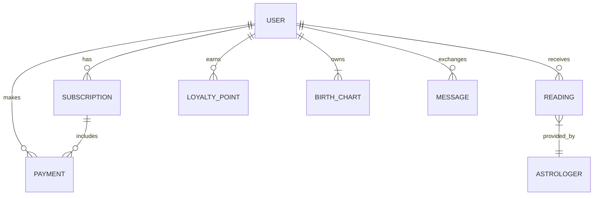

# Data Models Overview

This document provides a high-level overview of the core data entities within the Astrology WhatsApp Bot system. Detailed schema definitions and relationships will be maintained within the database migration scripts and API documentation.

## Core Entities

### 1. User

Represents a registered user of the astrology bot.

- **Attributes**: User ID (PK), WhatsApp Number, Name, Gender, Date of Birth, Time of Birth, Place of Birth, Time Zone, Preferred Language, Astrological Preferences, Communication Preferences, Security Settings, Subscription ID (FK).
- **Relationships**: One-to-many with Subscriptions, Readings, Payments.

### 2. Birth Chart

Stores the astrological birth details and calculated chart data for a user.

- **Attributes**: Birth Chart ID (PK), User ID (FK), Date of Birth, Time of Birth, Place of Birth (latitude, longitude), Time Zone, Calculated Planetary Positions, House Cusps, Aspects, Ayanamsa (for Vedic).
- **Relationships**: One-to-one with User.

### 3. Subscription

Manages user subscriptions to different service tiers.

- **Attributes**: Subscription ID (PK), User ID (FK), Tier (Free, Essential, Premium, VIP), Start Date, End Date, Status (Active, Expired, Cancelled), Auto-renewal Status, Payment ID (FK).
- **Relationships**: Many-to-one with User, One-to-many with Payments.

### 4. Reading

Records individual astrological readings or consultations provided to a user.

- **Attributes**: Reading ID (PK), User ID (FK), Astrologer ID (FK, if human), Type (Horoscope, Tarot, Vedic, etc.), Request Timestamp, Response Timestamp, Content (text, media reference), Status, Cost, Rating.
- **Relationships**: Many-to-one with User, optional Many-to-one with Astrologer.

### 5. Payment

Tracks all payment transactions made by users.

- **Attributes**: Payment ID (PK), User ID (FK), Subscription ID (FK, optional), Amount, Currency, Payment Method, Transaction ID (from gateway), Status (Success, Failed, Pending), Timestamp.
- **Relationships**: Many-to-one with User, Many-to-one with Subscription.

### 6. Loyalty Point

Manages loyalty points earned and redeemed by users.

- **Attributes**: Loyalty ID (PK), User ID (FK), Points Earned, Points Redeemed, Current Balance, Transaction Type (Referral, Purchase, Check-in), Timestamp.
- **Relationships**: Many-to-one with User.

### 7. Astrologer (for Human Astrologer Chat/Marketplace)

Represents certified human astrologers available for consultations.

- **Attributes**: Astrologer ID (PK), Name, Specialization, Bio, Rating, Availability, Commission Rate.
- **Relationships**: One-to-many with Readings.

### 8. Message

Stores the history of WhatsApp messages exchanged with the bot.

- **Attributes**: Message ID (PK), User ID (FK), Direction (Inbound, Outbound), Content, Timestamp, WhatsApp Message ID.
- **Relationships**: Many-to-one with User.

### 9. Tarot Card

Stores information and meanings for each Tarot card.

- **Attributes**: Card ID (PK), Name, UprightMeaning, ReversedMeaning, Keywords, ImageryDescription, Deck (e.g., Rider-Waite-Smith).
- **Relationships**: None (reference data).

### 10. Numerology Interpretation

Stores interpretations for various numerological numbers.

- **Attributes**: Number (PK), Type (e.g., Life Path, Destiny), Interpretation, Strengths, Challenges, Keywords.
- **Relationships**: None (reference data).

### 11. Palmistry Feature

Stores interpretations for various palm lines, mounts, and hand shapes.

- **Attributes**: Feature ID (PK), Name, Type (e.g., Line, Mount, Shape), Description, InterpretationLong, InterpretationShort, Keywords.
- **Relationships**: None (reference data).

## Relationships Overview

